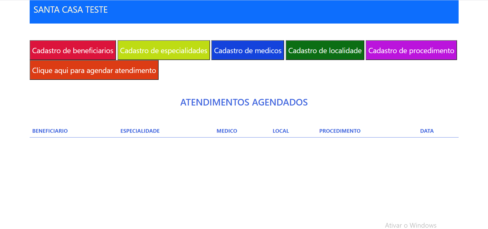

# santa-web

AS TABELAS ESTA NA PASTA sql, no arquivo santa_banco.sql

as tabelas estão criadas com as chaves estrangeiras e suas relações

o arquivo doc.word com as resposta nele respondido

de um git clone neste repositorio

a aplicação roda na index.php

as pastas de telas são onde fica os formularios

pasta css de onde fica os estilos

foram usados bootstrap,css,html5,php

